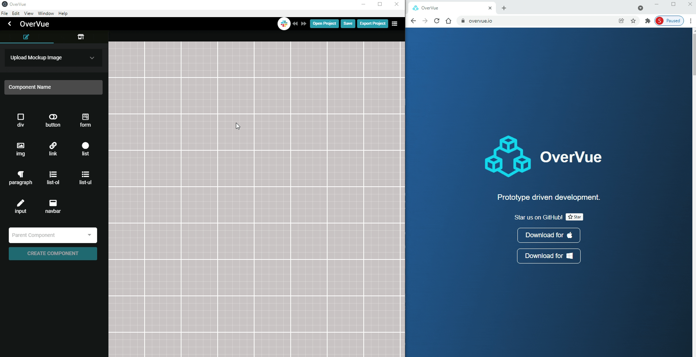
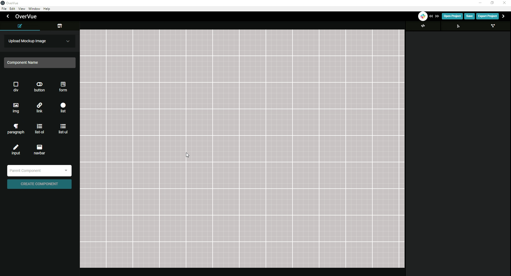
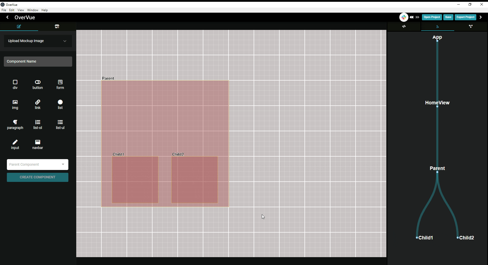

<h1 align="center">
  
</h1>

<p align="center"><b>Prototyping Development Tool for Vue Developers</b></p>

<p>OverVue is a prototyping tool that allows developers to dynamically create and visualize a Vue application, implementing a real-time intuitive tree display of component hierarchy and a live-generated code preview. The resulting boilerplate can be exported as a template for further development.</p>

<p>这个程序能帮你生成Vue 组件, 设置 routes , 也可以帮你显像Component Parent-Child组件树。你只要做一些小配置然后可以下载code boilerplate. 这样你就可以很方便简洁地生成Vue前台APP了！</p>


## Table of Contents

- [Table of Contents](#table-of-contents)
  - [Features](#features)
  - [Changelog 2.0](#changelog-20)
  - [Changelog 3.0](#changelog-30)
  - [Changelog 4.0](#changelog-40)
  - [Changelog 5.0](#changelog-50)
  - [Changelog 6.0](#changelog-60)
- [How to use](#how-to-use)
- [Installation](#installation)
  - [WSL Installation](#wsl-installation)
  - [Running the Docker Image](#running-the-docker-image)
- [BETA](#beta)
  - [Slack OAuth](#slack-oauth)
- [Contributing](#contributing)
- [Authors](#authors)

### Features

- Upload a frontend mockup image
- Visualize draggable and resizable components
- Create parent-child hierarchy of components
- Add html elements to components
- Create routes to be used by Vue Router
- Live-generated previewable code snippets for each component
- Live-generated tree view to aid in visualizing parent-child hierarchy
- Save projects and open previous projects
- Export full boilerplate code for a working frontend
- Undo/redo functionality <sub><sup>(v2.0)</sup></sub>
- Ability to navigate into HTML elements from a selected Vue component <sub><sup>(v2.0)</sup></sub>
- Assign one image per route <sub><sup>(v2.0)</sup></sub>
- Can now set Vue components to specific layers <sub><sup>(v2.0)</sup></sub>
- Will now load route images along with project <sub><sup>(v2.0)</sup></sub>
- Windows compatibility for uploading mockup images. <sub><sup>(v2.0)</sup></sub>
- Full Vuex functionality, can add props, actions, and state to components. <sub><sup>(v3.0)</sup></sub>
- Full edit functionality, can change the name of components as well as delete properties from a component <sub><sup>(v3.0)</sup></sub>
- More robust code snippets with Vuex props, state, and actions included <sub><sup>(v3.0)</sup></sub>
- Hotkey shortcuts to copy/paste/delete selected component <sub><sup>(v4.0)</sup></sub>
- Connect to a Slack Workspace and send Slack Messages through OverVue <sub><sup>(v4.0)</sup></sub>
- Ability to delete states or actions from the store <sub><sup>(v4.0)</sup></sub>
- Vue Devtools enabled for Developers <sub><sup>(v4.0)</sup></sub>/automatically deploys when running electron in dev mode <sub><sup>(v5.0)</sup></sub>
- Exports fully functional Vue 3/Vuex 4 syntax <sub><sup>(v5.0)</sup></sub>
- Import of individual components <sub><sup>(v6.0)</sup></sub>
- Containerized the application <sub><sup>(v6.0)</sup></sub>
- Introduced TypeScript Mode <sub><sup>(v6.0)</sup></sub>
- Adding notes functionality  <sub><sup>(v6.0)</sup></sub>
- Enhanced component tree hierarchy display <sub><sup>(v6.0)</sup></sub>

[↥Back to top](#table-of-contents)

### Changelog 2.0

<details><summary>OverVue 2.0</summary>
  <ul>
  <li>Improved hierarchy tree rendering</li>
  <li>Improved Route addition and deletion</li>
  <li>Able to search for components by name</li>
  <li>Improved UI to be more informative</li>
  <li>UI is more reactive, code snippets update dynamically </li>
  <li>Component children menu is consistent with children list at time of creation</li>
  <li>Children components can no longer choose any of their ancestors to be their children.</li>
  <li>Can now use Quasar build -m electron to make windows .exe </li>
  <li>Exporting projects now exports the mockup files as well into the assets folder</li>
  <li>Saving projects now saves the mockup image url</li>
  <li>Extensive bug fixing for Vue component and HTML element deletion behavior, exporting and saving.</li>
  </ul>
</details>

### Changelog 3.0

<details><summary>OverVue 3.0</summary>
  <ul>
  <li>Implemented full component edit functionality</li>
  <li>Improved sidebar user interface to consolidate edit functionality</li>
  <li>UI is more reactive, improved dashboard's ability to update dynamically </li>
  <li>Added ability to incorporate Vuex in application</li>
  <li>Updated component details section to better display all aspects of a component</li>
  <li>Added action, state, and props section to component details dashboard</li>
  <li>New Vuex store dashboard section</li>
  <li>More robust code snippets with Vuex props, state, and actions included</li>
  <li>Bug fixes for parent/child issues</li>
  <li>Improved Documentation for easier onboarding of new contributors</li>
  </ul>
</details>

### Changelog 4.0

<details><summary>OverVue 4.0</summary>
  <ul>
    <li>Integrated Slack through a Slack Login button to link user's slack channel to their OverVue instance</li>
    <li>After logging in with Slack, user's have the ability to send a message to their selected Slack channel after saving</li>
    <li>Implemented the ability to delete State and Actions from the store</li>
    <li>Added the feature to quickly copy/paste Components through hotkeys</li>
    <li>Reworked the interface to give users a more intuitive experience</li>
    <ul>
      <li>Moved bottom dashboard to the right</li>
      <li>Features on the left are geared toward creation/editing components</li>
      <li>Features on the right are geared toward viewing overall hierarchy of App Prototype</li>
      <li>Component Editor menu now switches between create/edit mode depending on if a Component is selected</li>
      <li>Vuex Store and Actions now moved to left menu with ability to view/create/delete state and actions</li>
    </ul>
    <li>Implemented Vue Devtools for development ease</li>
    <li>Sped up component tree rendering speed for quicker, smoother viewing</li>
    <br>
    <h4><strong>Bug Fixes</strong></h4>
    <li>Fixed html buttons not properly rendering for selected component</li>
    <li>Fixed code snippet not properly rendering for selected component</li>
    <li>Fixed JSON parser typeerror with component html lists</li>
    <li>Fixed component tree view rendering instability with right sidebar</li>
    <li>Fixed children and parent relationship mutations causing type related side effects</li>
    <li>Fixed issue where state/actions deleted in store aren't reflected across components</li>
    <li>Fixed issue with undo feature that would delete inputed text one character at a time</li>
  </ul>
</details>

### Changelog 5.0

<details><summary>OverVue 5.0</summary>
  <ul>
    <li>Upgraded source code to Vue 3</li>
    <li>Upgraded major dependencies to newest versions</li>
    <ul>
      <li>Upgraded from Vuex 3 to Vuex 4</li>
      <li>Upgraded from Electron 5 to 16</li>
      <li>Upgraded from Quasar 1 to 2</li>
    </ul>
    <li>Rewrote exports in Vue 3</li>
    <li>Reconfigured Vue Devtools to launch and connect upon running quasar in dev mode</li>
    <li>Note that due to breaking changes when upgrading to Vue 3, vued3tree had to be replaced with vue3-tree.Due to this, a bulleted list currently renders instead of a tree.  This is intended to be a short-term change, with the old package being utilized again once it is compatible.</li>
  </ul>
</details>

### Changelog 6.0

<details><summary>OverVue 6.0</summary>
  <ul>
    <li>Toggle to TypeScript mode to generate code snippets and export your project or individual components in TypeScript</li>
    <li>An interactive and real-time tree display of your component hierarchy allows you to easily visualize parent-child component relationships and the Vue Router structure</li>
    <li>Enhance your workflow by adding notes to your components. When you export your project or components into your favorite IDE, notes will be converted into comments within your Vue files.</li>
    <li>Now with a “Get Started” tutorial, a visual queue of your HTML elements, and an overall simplified UI, OveVue is as intuitive as ever. </li>
    <li>OverVue is now containerized with Docker to bring developers the same experience, regardless of your operating system.</li>
    <br>
    <h4><strong>Bug Fixes</strong></h4>
    <li>Fixed drawer disappearing when the window size is smaller</li>
    <li>Fixed inability to delete parent/child relationship</li>
    <li>Fixed the inability to add multiple children to parent except when making a new component</li>
    <li>Fixed CodeSnippet does not scroll when it overflows the container</li>
    <li>Fixed clicking canvas does not fully deactivate active component</li>
    <li>Fixed Error handling for 'pasting' component when no component is copied</li>
    <li>Fixed dancing components</li>
    <li>Fixed project tree visulization</li> 
  </ul>
</details>
<br/>

[↥Back to top](#table-of-contents)

## How to use

- Upon opening the application a Connect to Slack button will appear. To skip this step click 'Skip'
- Click the button to open a browser window, log in to your Slack workspace and select a channel to send save notifications.
- If you have logged in to Slack, upon saving your project file you will receive a prompt with the option to notify your team.
  

- OverVue will assign a default root App component and a default route called "HomeView"
- Upload a mockup from your filesystem if you'd like. Remove the mockup and choose a new one if needed.
  

- To add a new component, type its name in the component name box and select any HTML elements that should be rendered by that component.
- HTML elements can also be added after creation by selecting the component in the display, then selecting HTML elements.
- Select a parent component for the new component if needed.
- After adding, you can move and resize the component in the display.
  

- You can also duplicate components with Ctrl/Cmd C & V and see the component tree updated in real time.
- Duplicate components will appear offset from their original and retain the same state and route assignments.
  

- Child components will inherit the same parents, but parent components will not inherit duplicate children.
  

- The right-side drawer displays live code snippets for the selected element.  
  

- You can view and add new routes and associated components in the left-hand drawer.
  

- State and actions can be created, edited, and assigned to components.
  

- When finished creating, you can export to a file location of your choice. Below is the exported file structure:

```
public/
  index.html
src/
  assets/
  components/
    UserCreatedComponent1.vue
    UserCreatedComponent2.vue
    ...
  router/
    index.js
  views/
    HomeView.vue
    UserCreatedRouteComponent1.vue
    UserCreatedRouteComponent2.vue
    ...
  App.vue
  main.js
babel.config.js
package.json
```
<br/> 

[↥Back to top](#table-of-contents)

## Installation

To download the development version for windows or mac, please visit https://www.Overvue.io

This app was developed using the Quasar framework, so first you will need to install the Quasar cli

```
npm i -g @quasar/cli
```

Install dependencies

```
npm i
```

To run electron app in dev mode (note: Vue Devtools will launch automatically)

```
quasar dev -m electron
```

To build a new .dmg / windows .exe

```
quasar build -m electron
```

### WSL Installation

**The ability to load the application and/or devtools requires a tool/application to run a linux display as WSL does not have any display drivers since it is based off of just a CLI.
I recommend X410 (https://x410.dev/), althought it does cost \$15, for ease of use. There are free options such as VcXsrv(https://sourceforge.net/projects/vcxsrv/) that you can get, but requires more set up.**

If you choose to use x410, you will need to set the environment DISPLAY variable on each console:

So, to open either the Vue devtools or OverVue in dev mode, first start your X Server then enter into the terminal:
For WSL 1 :

```
export DISPLAY=:0
```

For WSL 2 :

```
export DISPLAY=$(awk '/nameserver / {print $2; exit}' /etc/resolv.conf 2>/dev/null):0
export LIBGL_ALWAYS_INDIRECT=1
```

followed by the command for the s or devmode. If you want both open, enter commands above followed by starting the devtools:

```
./node_modules/.bin/vue-devtools
```

Then open a new terminal instance, set the DISPLAY value again (re-enter above command for DISPLAY), and start OverVue in dev mode:

```
quasar dev -m electron
```
**NOTE** Electron-deeplink currently does not work on our WSL2 computers and output an error during installing the dependency which prevented the application to open in dev mode. Go to /src-electron/electron-main.js and comment out line 3/import line to bypass error. The developers did not find any impacts on application so far.

## Running the Docker Image

To run the built version, pull down the docker image from [Docker repo]

In your terminal, run:

```
docker run -v /tmp/.X11-unix:/tmp/.X11-unix -e DISPLAY=$DISPLAY -v`pwd`/src:/app/src --rm -it overvue
```
### Running the dev environment on Docker as a Mac User
To run OverVue through Docker on a Mac, you'll need to install XQuartz:
```
brew install --cask xquartz
```

<strong>Important:</strong> RESTART your computer.

Update your PATH variable to /opt/x11/bin to your .zshrc. For example:
```
export PATH=/opt/X11/bin:$PATH
```

Set up XQuartz:
<ul>
<li>Launch XQuartz</li>
<li>Under the XQuartz menu, select Preferences.</li>
<li>Go to the security tab and ensure "Allow connections from network clients" is checked.</li>
<li>Restart XQuartz</li>
</ul>

Run the following command in your terminal (replacing localhostname with your local host name)
```
xhost +localhostname
```
If you don't know your local host name, run the following command to find it:
```
echo $(hostname)
```

Build the image using Dockerfile-Mac:
```
docker build -t overvue -f Dockerfile-Mac .
```

Run the image using the following command
```
docker run -it --env="DISPLAY=$(ifconfig en0 | grep inet | awk '$1=="inet" {print$2}'):0" --security-opt seccomp=./chrome.json overvue
```

Run in dev mode using:
```
npm run dev 
```

For more information about running Electron through Docker on a Mac, check out these posts:
<li><a href="https://jaked.org/blog/2021-02-18-How-to-run-Electron-on-Linux-on-Docker-on-Mac">How to run Electron on Linux on Docker on Mac</a></li>
<li><a href="https://gist.github.com/paul-krohn/e45f96181b1cf5e536325d1bdee6c949">Workaround for sockets on Docker on macOS</a></li>
<li><a href="https://blog.jessfraz.com/post/how-to-use-new-docker-seccomp-profiles/">How to use new Docker seccomp profiles</a></li>
<br/>

### Running the dev environment on Docker as a WSL user

Build the image using Dockerfile-WSL:
```
docker build -t overvue -f Dockerfile-WSL .
```

To run 
```
docker run -v /tmp/.X11-unix:/tmp/.X11-unix -e DISPLAY=$DISPLAY -v`pwd`/src:/app/src --rm -it overvue bash
```

Run in dev mode using:
```
npm run dev
```
<br/>

## BETA
### Slack OAuth

For the Slack OAuth, you will need to create a Slack app through their website (https://api.slack.com/apps?new_app=1), so that you have your own Client Secret and Client ID. Then create two .env files (one for development and one for production).

1. Create a Slack App from the link above. Copy your Client ID and Client Secret somewhere safe.
2. Create two .env files in the main root of this repository. Name them:

```
.env
.env.development
```

3. Open .env and add these three environment variables. Replace <client secret> and <client id> with the client id and client secret given to you when you created your Slack App.

```
SLACK_CLIENT_SECRET = "<client secret>"
SLACK_CLIENT_ID = "<client id>"
SLACK_REDIRECT_URI = "overvue://slack"
```

4. Next, open .env.development and do the same, just note that the SLACK_REDIRECT_URI will be different here:

```
SLACK_CLIENT_SECRET = "<client secret>"
SLACK_CLIENT_ID = "<client id>"
SLACK_REDIRECT_URI = "overvuedev://test"
```

[↥Back to top](#table-of-contents)

## Contributing

We'd love for you to test this application out and submit any issues you encounter. Also feel free to fork to your own repo and submit PRs.
Here are some features we're thinking about adding:


- Ability to place child components into HTML elements
- More semantic HTML tag options
- Ability to export Vuex store boilerplate
- Ability to add two-way binding to input elements
- More granular typing options for TypeScript mode

If you make changes and wish to update the website, here is the link to the repo: https://github.com/TeamOverVue/OverVuePage

<br/>

[↥Back to top](#table-of-contents)

## Authors

```
Contributors:
Joseph Eisele @jeisele2
Dean Chung @deanfchung
Dean Ohashi @dnohashi
Drew Nguyen @drewngyen
Alexander Havas @LOLDragoon
Keriann Lin @keliphan
Allison Pratt @allisons11
Joju Olaode @JojuOlaode
Sean Grace @ziggrace
Nicholas Schillaci @schillaci767
Terry Tilley @codeByCandlelight
Faraz Moallemi @farazmoallemi
Alex Lu @aleckslu
Jeffrey Sul @jeffreysul
Kenny Lee @kennyea
Ryan Bender @rdbender
Sonny Nguyen @sn163
Gabriela Kokhabi @gkokhabi
Ross Lamerson @lamerson28
Shanon Lee @shanonlee541
Zoew McGrath @Z-McGrath
Aram Paparian @apaparian
Bryan Bart @MrBeeAreWhy
Julia Bakerink @jbbake
Kerolos Nesem @Kerolos-Nesem
Megan Nadkarni @megatera
```

Inspired by [PreVue](https://github.com/open-source-labs/PreVue)

<br/>

[↥Back to top](#table-of-contents)