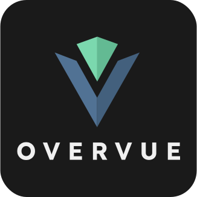
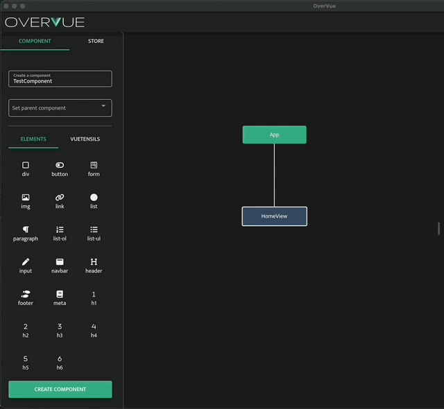
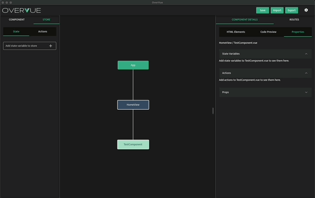

<h1 align="center">
  
</h1>

<p align="center"><b>Prototyping Development Tool for Vue Developers</b></p>

<p>OverVue is a prototyping tool that allows developers to dynamically create and visualize a Vue application, implementing a real-time intuitive tree display of component hierarchy and a live-generated code preview. The easy-to-use GUI allows you to add HTML attributes and CSS properties to help the developer envision their next project. The resulting boilerplate code can be exported as a template for further development in your IDE of choice.</p>

<hr>

<p>这个程序能帮你生成Vue 组件, 设置 routes , 也可以帮你显像Component Parent-Child组件树。你只要做一些小配置然后可以下载code boilerplate. 这样你就可以很方便简洁地生成Vue前台APP了！</p>
<hr>

<hr>


## Table of Contents

- [Installation](#installation)
- [How to use OverVue](#how-to-use-OverVue)
- [Changelogs](#changelogs-(recent))
- [How to contribute](#contributing)
- [Authors](#contributors)

## Installation

To download the production version, please visit https://www.overvue.org
<hr>

### Dev Installation

In your terminal:
1. Install dependencies ``npm install``


2. Build a new .zip / .deb:
``
  npm run build
``
*(Note: the build may take some time, but should display 'build finished' once it is done and ready to be run)*

3. Run electron app in dev mode: ``npm run dev``


<hr>

### Updated WSL Installation and Configuration Guide

This section has been updated to reflect the latest advancements with the Windows Subsystem for Linux (WSL), especially focusing on the integration of Linux GUI applications directly within WSL without the need for third-party X server tools like X410 or VcXsrv.

<details>
  <summary><strong>Expand</strong></summary>

## Running Linux GUI Applications in WSL

With the launch of WSLg (Windows Subsystem for Linux GUI), the process of running Linux GUI applications on Windows has been greatly simplified. WSLg integrates directly with WSL 2, offering native support for Linux GUI applications without the necessity for additional display server configurations.

### Prerequisites

- Windows 10 version 19044+ or Windows 11.
- WSL 2 installed and set as the default version. Use `wsl --install` for new installations or `wsl --update` followed by `wsl --shutdown` to update and restart WSL.

### Configuring Linux GUI Applications

WSLg automatically configures the necessary environment, eliminating the need to manually set display variables for GUI applications. Linux GUI apps can now be launched directly from the Start menu or via the command line, without additional setup.

### Legacy Setup Notes (Deprecated)

The previous guidance for setting up X410 or VcXsrv for Linux GUI applications in WSL is now deprecated. While these tools are no longer necessary for the majority of GUI applications in WSL, they remain available for those with specific requirements outside the scope of WSLg's capabilities.

### Docker Integration

For Docker containers that require GUI applications, ensure Docker Desktop for Windows is configured to use the WSL 2 backend. This integration with WSLg provides a seamless experience for running GUI-based containers.

### Additional Setup for Mac Users (Docker)

Mac users running Linux containers or WSL in a virtualized environment should follow the XQuartz setup for X11 forwarding, applicable only to those operating outside direct WSL integration on Windows.

1. Install XQuartz: `brew install --cask xquartz` and restart.
2. In XQuartz Preferences > Security, enable "Allow connections from network clients."
3. Allow localhost connections: `xhost +localhost`.

### Common Issues and Solutions

- **WSLg not functioning as expected?** Verify your Windows version and WSL 2 installation and updates.
- **Linux GUI app won't launch?** Ensure all components are up to date and the application is compatible with WSLg.

### Resources

- [WSLg Overview](https://aka.ms/wslg)
- [Setting up Docker with WSL 2](https://docs.docker.com/desktop/windows/wsl/)

This guide is designed to help streamline your development environment by utilizing the latest WSL features while minimizing complexity. For more information and detailed troubleshooting, refer to the [official WSL documentation](https://docs.microsoft.com/en-us/windows/wsl/).
</details>


## How to use OverVue

OverVue kickstarts your project with a default root App component and a "HomeView" route. Here's a quick guide to navigating and utilizing OverVue to its fullest:

1. **Creating Components:**
   - Enter a name for your new component in the component name box.
   - Select any HTML elements to include within your component. These can be added or nested within each other by dragging and dropping elements in the tree view on the right sidebar or within the component modal (accessible by double-clicking a component node).

2. **Organizing Components:**
   - Assign a parent component during or after creation to establish your desired hierarchy.
   - Modify your component's structure and relationships anytime by dragging nodes in the tree view. Double-click an HTML element for advanced styling options, including adding attributes like `class`, `ID`, and `v-model`.

This streamlined approach helps you focus on building and visualizing your Vue.js application's component structure efficiently, with intuitive drag-and-drop functionality and easy access to advanced configuration options.



3. **Managing State and Actions:**
    - Get a live preview of your component's code in the Component Details > Code Preview Tab.


    - Handle routes and associated components using the Routes Tab.


    - Create, edit, and assign state and actions to your components.




  - When finished creating, view your code preview under the code preview tab and you can export to a file location of your choice. Below is the exported file structure ('*' = only in typescript format, '**' = only in test format:


```
public/
src/
  assets/
  components/
    (YourNewComponent1.vue)
    (YourNewComponent2.vue)
    ...
  router/
    index.js/ts
  store/
    index.js/ts
  views/
    HomeView.vue
    (YourNewRoute1.vue)
    (YourNewRoute2.vue)
    ...
  App.vue
  main.js/ts
tests/
  units**
.eslintrc.cjs
env.d.ts*
babel.config.js/ts
jest.config.js/ts**
index.html
package.json
vite.config.js/ts
```

- To get a better look at the features and how to use OverVue, take a look at the in-app tutorial!

<br/>

[↥ Back to top](#table-of-contents)


## Changelogs (recent)


<details><summary>OverVue 11.0</summary>
<ul>
<li>UI redesign and overhaul - focus on accesibility features and increaesd contrast</li>

<li> Major update to depenendencies since last version, increasing compatibility between multiplatform OS and re-establishing fix for Windows users </li>
<li> Toggle switch from Vue 2 Options API code generation to Vue 3 Compositions API under 'Code Preview' </li>
<li> Refactored codebase, clean-up unused old code, unused files for optimization of Electron build </li>
<li> Optimize images displayed to take a smaller footprint and increase speeds or older systems </li>
<li> Slack and Github OAuth feature has been hidden as currently the feature is not working, and is not seeing much use either </li>
<li> Website has been updated with the latest OverVue 11.0 releases for the community to use  </li>

<br>

<h4><strong>Bug Fixes</strong></h4>
<li> Fixed Import and Export functionalities </li>
<li> Removed unused and outdated dependencies which removed and introduced new bugs (if new bugs are found please mention this in the issues tab) </li>
<li> Removed unused files and code to speed up build time</li>
<li> Major update to dependencies which greatly sped up speed of application </li>


</ul>
</details>


<details><summary>OverVue 10.0</summary>
<ul>
<li>Overhauled main view to be an interactive and intuitive tree view</li>
<li>Updated HTML Elements list to have nested elements</li>
<li>Created a focused component modal</li>
<li>Integrated a11y-friendly Vuetensils component library</li>
<li>Added unit testing for main tree view feature</li>
<li>Refactored codebase, removing unneeded comments, unused files, console logs</li>
<li>Cleaned UI of side bars</li>
<li>Added previous main grid view to toggle (in top right settings)</li>
<br>
<h4><strong>Bug Fixes</strong></h4>
<li>Fixed HTML elements not live rendering</li>
<li>Fixed delete HTML element functionality being inconsistent</li>
<li>Fixed Code Preview having unexpected code (i.e. v-model=undefined)</li>
<li>Fixed various bugs related to empty HTML lists or routes with no children</li>
<li>Fixed import statements and nesting in Code Preview and exported code</li>
<li>Fixed entire testing suite</li>
</ul>
</details>


<details><summary>OverVue 9.0</summary>
<ul>
<li>Converted codebase (40+ components) from Options API to Composition API</li>
<li>Migrated store from Vuex to Pinia</li>
<li>Migrated codebase to TypeScript</li>
<li>Implemented testing of Pinia store</li>
<li>Updated Electron builder dependency</li>
<li>UI overhaul</li>
<br>
<h4><strong>Bug Fixes</strong></h4>
<li>Fixed nesting HTML elements functionality</li>
<li>Fixed adding innerText functionality</li>
<li>Fixed formatting of exported code</li>
<li>Fixed parent child component relationship in code snippet and on export</li>
<li>Fixed typing and initial values of store to match actions usage</li>
<li>Eliminated code redundancy by implementing Composition API and Pinia</li>
</ul>
</details>


### <summary>Changelogs 8.0 and older</summary>

<details> <details><summary>OverVue 8.0</summary>
<ul>
<li>Added component snap to grid functionality with additional grid density drop down menu feature</li>
<li>Code snippet reflects CSS grid area styling of components </li>
<li>Ability to import components from Element Plus library</li>
<li>Exported project template code now more accurately reflects component placement in app</li>
<li>Improved canvas drag and deselect</li>
<li>Improved WSL developer installation instructions</li>
<li>Added TypeScipt to application</li>
<li>Implemented component search bar feature</li>
<li>Ability to add Google and Github OAuth to exported project</li>
<li>Added unit testing and component testing boilerplate to exported project</li>
<li>UI overhaul</li>
<br>
<h4><strong>Bug Fixes</strong></h4>
<li>Fixed routing components in project exports </li>
<li>Fixed component hierarchy in project exports </li>
<li>Fixed import statements of route child components</li>
<li>Fixed edge case HTML element bugs in project exports </li>
<li>Fixed in app component movement bugs which caused position to not update correctly </li>
<li>Fixed drag and drop HTML element on click bug</li>
<li>Eliminated code redundancy by implementing mixins</li>
</ul>
</details>


<details><summary>OverVue 7.0</summary>
<ul>
<li>Color customizability of components </li>
<li>Code snippet reflects CSS styling of components </li>
<li>Added more semantic HTML tags</li>
<li>Options to add class, ID, and v-model attributes</li>
<li>Added drag and drop feature when adding/altering HTML tags</li>
<li>Ability to add child components to the code snippet of parent components </li>
<li>Added scoped style tags - On class creation will create styling entry with positioning of component/html element</li>
<li>Consolidated state/actions/props into one tab</li>
<li>UI overhaul</li>
<br>
<h4><strong>Bug Fixes</strong></h4>
<li>Fixed undo and redo capabilities </li>
<li>Fixed badge number not rendering for nested HTML tags</li>
</ul>
</details>


<details><summary>OverVue 6.0</summary>
  <ul>
    <li>Toggle to TypeScript mode to generate code snippets and export your project or individual components in TypeScript</li>
    <li>An interactive and real-time tree display of your component hierarchy allows you to easily visualize parent-child component relationships and the Vue Router structure</li>
    <li>Enhance your workflow by adding notes to your components. When you export your project or components into your favorite IDE, notes will be converted into comments within your Vue files.</li>
    <li>Now with a “Get Started” tutorial, a visual queue of your HTML elements, and an overall simplified UI, OveVue is as intuitive as ever. </li>
    <li>OverVue is now containerized with Docker to bring developers the same experience, regardless of your operating system.</li>
    <br>
    <h4><strong>Bug Fixes</strong></h4>
    <li>Fixed drawer disappearing when the window size is smaller</li>
    <li>Fixed inability to delete parent/child relationship</li>
    <li>Fixed the inability to add multiple children to parent except when making a new component</li>
    <li>Fixed CodeSnippet does not scroll when it overflows the container</li>
    <li>Fixed clicking canvas does not fully deactivate active component</li>
    <li>Fixed Error handling for 'pasting' component when no component is copied</li>
    <li>Fixed dancing components</li>
    <li>Fixed project tree visulization</li>
  </ul>
</details>


<details><summary>OverVue 5.0</summary>
  <ul>
    <li>Upgraded source code to Vue 3</li>
    <li>Upgraded major dependencies to newest versions</li>
    <ul>
      <li>Upgraded from Vuex 3 to Vuex 4</li>
      <li>Upgraded from Electron 5 to 16</li>
      <li>Upgraded from Quasar 1 to 2</li>
    </ul>
    <li>Rewrote exports in Vue 3</li>
    <li>Reconfigured Vue Devtools to launch and connect upon running quasar in dev mode</li>
    <li>Note that due to breaking changes when upgrading to Vue 3, vued3tree had to be replaced with vue3-tree.Due to this, a bulleted list currently renders instead of a tree.  This is intended to be a short-term change, with the old package being utilized again once it is compatible.</li>
  </ul>
</details>


<details><summary>OverVue 4.0</summary>
  <ul>
    <li>Integrated Slack through a Slack Login button to link user's slack channel to their OverVue instance</li>
    <li>After logging in with Slack, user's have the ability to send a message to their selected Slack channel after saving</li>
    <li>Implemented the ability to delete State and Actions from the store</li>
    <li>Added the feature to quickly copy/paste Components through hotkeys</li>
    <li>Reworked the interface to give users a more intuitive experience</li>
    <ul>
      <li>Moved bottom dashboard to the right</li>
      <li>Features on the left are geared toward creation/editing components</li>
      <li>Features on the right are geared toward viewing overall hierarchy of App Prototype</li>
      <li>Component Editor menu now switches between create/edit mode depending on if a Component is selected</li>
      <li>Vuex Store and Actions now moved to left menu with ability to view/create/delete state and actions</li>
    </ul>
    <li>Implemented Vue Devtools for development ease</li>
    <li>Sped up component tree rendering speed for quicker, smoother viewing</li>
    <br>
    <h4><strong>Bug Fixes</strong></h4>
    <li>Fixed html buttons not properly rendering for selected component</li>
    <li>Fixed code snippet not properly rendering for selected component</li>
    <li>Fixed JSON parser typeerror with component html lists</li>
    <li>Fixed component tree view rendering instability with right sidebar</li>
    <li>Fixed children and parent relationship mutations causing type related side effects</li>
    <li>Fixed issue where state/actions deleted in store aren't reflected across components</li>
    <li>Fixed issue with undo feature that would delete inputed text one character at a time</li>
  </ul>
</details>


<details><summary>OverVue 3.0</summary>
  <ul>
  <li>Implemented full component edit functionality</li>
  <li>Improved sidebar user interface to consolidate edit functionality</li>
  <li>UI is more reactive, improved dashboard's ability to update dynamically </li>
  <li>Added ability to incorporate Vuex in application</li>
  <li>Updated component details section to better display all aspects of a component</li>
  <li>Added action, state, and props section to component details dashboard</li>
  <li>New Vuex store dashboard section</li>
  <li>More robust code snippets with Vuex props, state, and actions included</li>
  <li>Bug fixes for parent/child issues</li>
  <li>Improved Documentation for easier onboarding of new contributors</li>
  </ul>
</details>


<details><summary>OverVue 2.0</summary>
  <ul>
  <li>Improved hierarchy tree rendering</li>
  <li>Improved Route addition and deletion</li>
  <li>Able to search for components by name</li>
  <li>Improved UI to be more informative</li>
  <li>UI is more reactive, code snippets update dynamically </li>
  <li>Component children menu is consistent with children list at time of creation</li>
  <li>Children components can no longer choose any of their ancestors to be their children.</li>
  <li>Can now use Quasar build -m electron to make windows .exe </li>
  <li>Exporting projects now exports the mockup files as well into the assets folder</li>
  <li>Saving projects now saves the mockup image url</li>
  <li>Extensive bug fixing for Vue component and HTML element deletion behavior, exporting and saving.</li>
  </ul>
</details></details>

[↥Back to top](#table-of-contents)

## How to contribute

<details><summary>Expand</summary>
<br/>

We'd love for you to test out the application and submit any issues you encounter. Also feel free to fork to your own repo and submit PRs.

<h4><strong>Here are some features we're thinking about adding:</strong></h4>

- Ability to add two-way binding to input elements
- Add E2E testing suite like Cypress
- Containerized the app to further support multi-platform distribution OR
- Adjust application to either a web app or an plugin extension on VSCode/Figma.


<h4><strong>Smaller desired changes</strong></h4>

- Patch save functionality to save state
- Highlight active HTML element when selected/updating
- HTML elements removal to re-render and update state count of elements used in components tree
- HTML elements list occasionally does not render properly after component is dragged
- Continue updating and rebalancing dependencies

<h4><strong>Known Bugs</strong></h4>
<li> Slack OAuth not working (currently disabled) </li>
<li> Canvas tree can only be moved with arrow keys </li>
<li> Not necessarily a bug, but certain peer dependencies are not updated by their maintainers (ie tesing vue with jest). To update to a new dependency, this requires ample amount of time that we unfortunately did not have</li>
<li> There may be more bugs that we did not find. If so please mention this in the 'Issues' tab  </li>

<br/>
</details>
<br/>

[↥Back to top](#table-of-contents)

## Contributors

| OverVue 11.0 | LinkedIn | GitHub |
|------|----------|--------|
| Anthony Herrera | [LinkedIn](https://www.linkedin.com/in/anthony-herrera-686ba0183/) | [@anthonyHerr](https://github.com/anthonyHerr) |
| Daniel Garan | [LinkedIn](https://www.linkedin.com/in/daniel-garan/) | [@DanielGaran02](https://github.com/DanielGaran02) |
| Kevin Can | [LinkedIn](https://www.linkedin.com/in/kevincan/) | [@Kelementz916](https://github.com/Kelementz916) |
| Robert Sinizieri | [LinkedIn](https://www.linkedin.com/in/rob-sinzieri/) | [@robsinz](https://github.com/robsinz) |
| Roderick de Leon | [LinkedIn](https://www.linkedin.com/in/roderickdeleon/) | [@RoderickXii](https://github.com/RoderickXii) |

<br>

| OverVue 10.0  | LinkedIn |GitHub |
|------|-------|------|
| David Lee  | [LinkedIn](https://www.linkedin.com/in/davidetlee/) | [@GomDave](https://github.com/GomDave)|
| Trisha Duong  | [LinkedIn](https://www.linkedin.com/in/trisha-duong-444123195/) | [@trishanduong](https://github.com/trishanduong) |
| Jaime de Venecia | [LinkedIn](https://www.linkedin.com/in/jaime-dv/) | [@jdvplus](https://github.com/jdvplus) |
| Janica Abagat  | [LinkedIn](https://www.linkedin.com/in/janica-abagat/) | [@janicaa1](https://github.com/janicaa1) |

<br>

| OverVue 9.0 | GitHub |
|------|--------|
| Ji Kim | [@dwejikim](https://github.com/dwejikim) |
| Chris Davis | [@chdavis0917](https://github.com/chdavis0917) |
| Linden Young | [@lindenyoung](https://github.com/lindenyoung) |
| Jigar Patel | [@jigarxp](https://github.com/jigarxp) |

<br>

| OverVue 8.0 | GitHub |
|------|--------|
| Emma Genesen | [@EGenesen](https://github.com/EGenesen) |
| Alex Law | [@alexlaw528](https://github.com/alexlaw528) |
| Honghao(Michael) Sun | [@sunhonghaoparis](https://github.com/sunhonghaoparis) |
| Chris Wong | [@Koregano73](https://github.com/Koregano73) |

<br>

| OverVue 7.0 | GitHub |
|------|--------|
| Katherine Kim | [@katherinek123](https://github.com/katherinek123) |
| Keyla Koizumi Nishimura | [@keylakoizumin](https://github.com/keylakoizumin) |
| Jace Crowe | [@JaceCrowe](https://github.com/JaceCrowe) |
| Johnny Chan | [@jchan444](https://github.com/jchan444) |

<br>

| OverVue 6.0 | GitHub |
|------|--------|
| Megan Nadkarni | [@megatera](https://github.com/megatera) |
| Kerolos Nesem | [@Kerolos-Nesem](https://github.com/Kerolos-Nesem) |
| Julia Bakerink | [@jbbake](https://github.com/jbbake) |
| Bryan Bart | [@MrBeeAreWhy](https://github.com/MrBeeAreWhy) |
| Aram Paparian | [@apaparian](https://github.com/apaparian) |

<br>

| OverVue 5.0 | GitHub |
|------|--------|
| Zoew McGrath | [@Z-McGrath](https://github.com/Z-McGrath) |
| Shanon Lee | [@shanonlee541](https://github.com/shanonlee541) |
| Ross Lamerson | [@lamerson28](https://github.com/lamerson28) |
| Gabriela Kokhabi | [@gkokhabi](https://github.com/gkokhabi) |

<br>

| OverVue 4.0 | GitHub |
|------|--------|
| Sonny Nguyen | [@sn163](https://github.com/sn163) |
| Ryan Bender | [@rdbender](https://github.com/rdbender) |
| Kenny Lee | [@kennyea](https://github.com/kennyea) |
| Jeffrey Sul | [@jeffreysul](https://github.com/jeffreysul) |
| Alex Lu | [@aleckslu](https://github.com/aleckslu) |

<br>

| OverVue 3.0 | GitHub |
|------|--------|
| Faraz Moallemi | [@farazmoallemi](https://github.com/farazmoallemi) |
| Terry Tilley | [@codeByCandlelight](https://github.com/codeByCandlelight) |
| Nicholas Schillaci | [@schillaci767](https://github.com/schillaci767) |
| Sean Grace | [@ziggrace](https://github.com/ziggrace) |

<br>

| OverVue 2.0| GitHub |
|------|--------|
| Joju Olaode | [@JojuOlaode](https://github.com/JojuOlaode) |
| Allison Pratt | [@allisons11](https://github.com/allisons11) |
| Keriann Lin | [@keliphan](https://github.com/keliphan) |
| Alexander Havas | [@LOLDragoon](https://github.com/LOLDragoon) |

<br>

| OverVue 1.0| GitHub |
|------|--------|
| Drew Nguyen | [@drewngyen](https://github.com/drewngyen) |
| Dean Ohashi | [@dnohashi](https://github.com/dnohashi) |
| Dean Chung | [@deanfchung](https://github.com/deanfchung) |
| Joseph Eisele | [@jeisele2](https://github.com/jeisele2) |


<hr>

OverVue was inspired by [PreVue](https://github.com/open-source-labs/PreVue)

<br/>

[↥Back to top](#table-of-contents)
