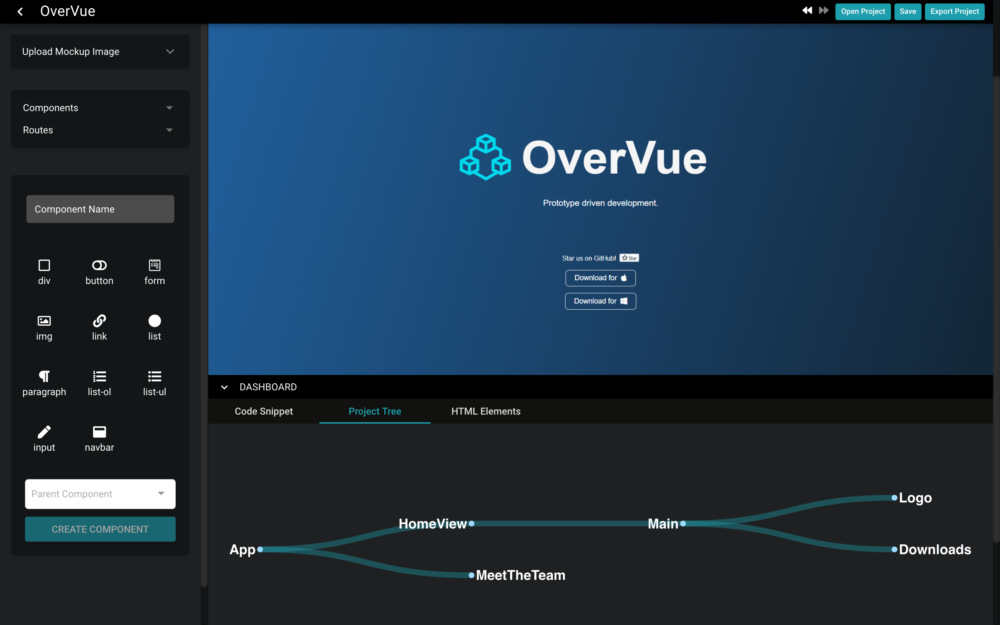
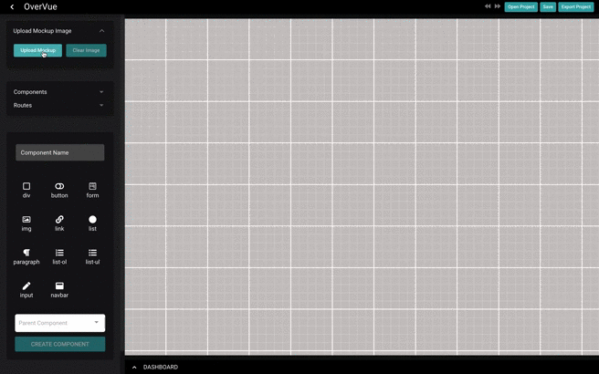
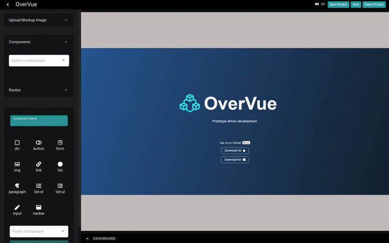
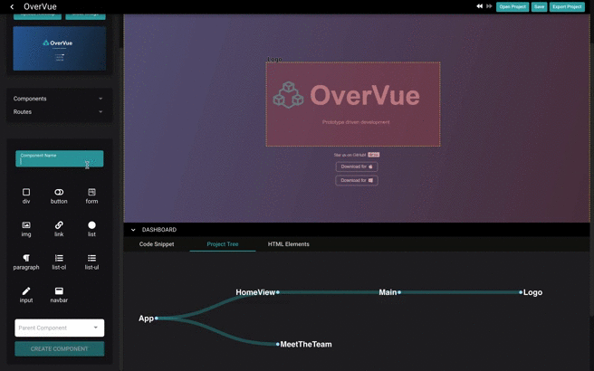
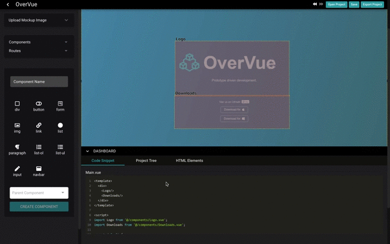
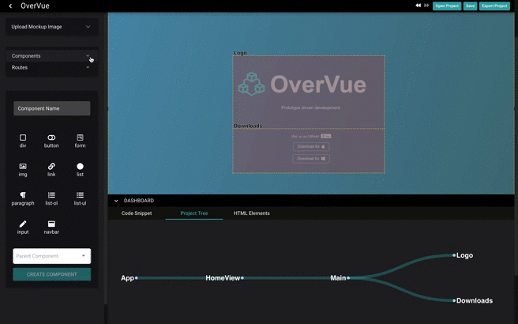
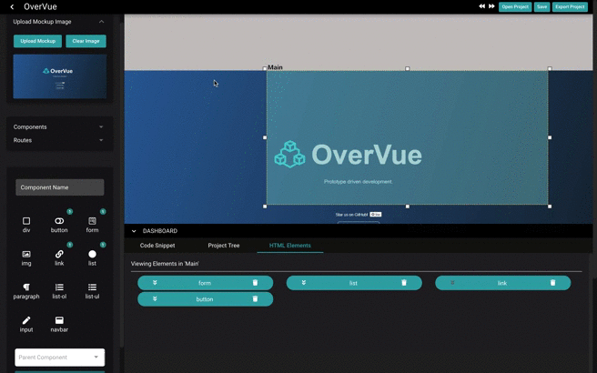
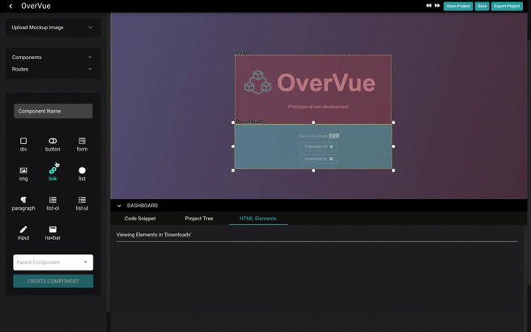
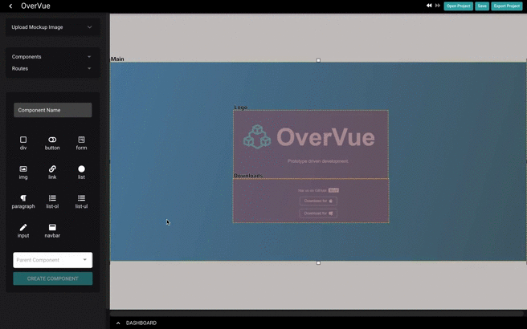

<h1 align="center">
  
  <br/>
  OverVue 
</h1>

<p align="center"><b>Prototyping Tool for Vue Developers</b></p>

<p>OverVue is a prototyping tool that allows developers to dynamically create and visualize a Vue application, implementing a real-time intuitive tree display of component hierarchy and a live-generated code preview. The resulting boilerplate can be exported as a template for further development.</p>

<p>这个程序能帮你生成Vue 组件, 设置 routes , 也可以帮你显像Component Parent-Child组件树。你只要做一些小配置然后可以下载code boilerplate. 这样你就可以很方便简洁地生成Vue前台APP了！</p>



## Table of Contents

* [Features](#features)
* [OverVue 2.0 Changelog](#changelog-20)
* [OverVue 3.0 Changelog](#changelog-30)
* [Tutorial](#how-to-use)
  + [New Features Tutorial 2.0](#overvue-v20-how-to)
  + [New Features Tutorial 3.0](#overvue-v30-how-to)
* [How to Run](#running-a-local-version)
* [Contributing](#contributing)
* [Authors](#authors)

### Features
+ Upload a frontend mockup image
+ Visualize draggable and resizable components
+ Create parent-child hierarchy of components
+ Add html elements to components
+ Create routes to be used by Vue Router
+ Live-generated previewable code snippets for each component
+ Live-generated tree view to aid in visualizing parent-child hierarchy
+ Save projects and open previous projects
+ Export full boilerplate code for a working frontend
+ Undo/redo functionality <sub><sup>(v2.0)</sup></sub>
+ Can nest HTML elements <sub><sup>(v2.0)</sup></sub>
+ Ability to navigate into HTML elements from a selected Vue component <sub><sup>(v2.0)</sup></sub>
+ Assign one image per route <sub><sup>(v2.0)</sup></sub>
+ Can now set Vue components to specific layers <sub><sup>(v2.0)</sup></sub>
+ Will now load route images along with project <sub><sup>(v2.0)</sup></sub>
+ Windows compatibility for uploading mockup images. <sub><sup>(v2.0)</sup></sub>
+ Full Vuex functionality, can add props, actions, and state to components. <sub><sup>(v3.0)</sup></sub>
+ Full edit functionality, can change the name of components as well as delete properties from a component <sub><sup>(v3.0)</sup></sub>
+ More robust code snippets with Vuex props, state, and actions included <sub><sup>(v3.0)</sup></sub>

[↥Back to top](#table-of-contents)

### Changelog 2.0
<details><summary>OverVue 2.0</summary>
  <ul>
  <li>Improved hierarchy tree rendering</li>
  <li>Improved Route addition and deletion</li>
  <li>Able to search for components by name</li>
  <li>Improved UI to be more informative</li>
  <li>UI is more reactive, code snippets update dynamically </li>
  <li>Component children menu is consistent with children list at time of creation</li>
  <li>Children components can no longer choose any of their ancestors to be their children.</li>
  <li>Can now use Quasar build -m electron to make windows .exe </li>
  <li>Exporting projects now exports the mockup files as well into the assets folder</li>
  <li>Saving projects now saves the mockup image url</li>
  <li>Extensive bug fixing for Vue component and HTML element deletion behavior, exporting and saving.</li>
  </ul>
</details>

### Changelog 3.0
<details><summary>OverVue 3.0</summary>
  <ul>
  <li>Implemented full component edit functionality</li>
  <li>Improved sidebar user interface to consolidate edit functionality</li>
  <li>UI is more reactive, improved dashboard's ability to update dynamically </li>
  <li>Added ability to incorporate Vuex in application</li>
  <li>Updated component details section to better display all aspects of a component</li>
  <li>Added action, state, and props section to component details dashboard</li>
  <li>New Vuex store dashboard section</li>
  <li>More robust code snippets with Vuex props, state, and actions included</li>
  <li>Bug fixes for parent/child issues</li>
  <li>Improved Documentation for easier onboarding of new contributors</li>
  </ul>
</details>

[↥Back to top](#table-of-contents)

## How to use
+ Opening the application will create by default a root App component and a root route called "HomeView"
+ Upload a mockup from your filesystem if you'd like. Remove the mockup and choose a new one if needed.


+ To add a new component, type its name in the component name box and select any HTML elements that should be rendered by that component.
+ HTML elements can also be added after creation by selecting the component in the display, then selecting HTML elements.
+ Select a parent component for the new component if needed.
+ After adding, you can move and resize the component in the display.


+ You can also add children to components by right-clicking the component to add children to, and you can see the tree re-render as you create new components or change the hierarchy.


+ The dashboard shows info about each component (code snippets and HTML elements). Click a component in the display to see its properties.                                               


+ You can add new routes and view all components and routes in the sidebar.


+ When finished creating, you can export to a file location of your choice. Below is the exported file structure:

```
public/
  index.html
src/
  assets/
  components/
    UserCreatedComponent1.vue
    UserCreatedComponent2.vue
    ...
  views/
    HomeView.vue
    UserCreatedRouteComponent1.vue
    UserCreatedRouteComponent2.vue
    ...
  App.vue
  main.js
  router.js
babel.config.js
package.json
```
[↥Back to top](#table-of-contents)

### OverVue v2.0 How to
+ Undo/Redo feature has been added to the top right of the program, you can also use CTRL+z and CTRL+y respectively.


+ You can nest html elements in two different ways:
    1. Upon creating a component and adding an html element into it, Select the component to make it the active component.
    Go to the html elements tab and then double click on the html element you wish to be the target for your new elements.
    Once the html element is selected, use the left hand panel and start adding elements like you were adding it to a component.

    2. Similar to above, but instead of double clicking, you can press the down arrow icon on the html element button to enter it.
    From there the view will change to the contents of that particular HTML element.
    You can then add html elements like you would for a component using the left hand side
    

+ Setting layers on a component is done by right clicking the desired component on the component display and using the menu option
  All components start on layer 1 by default.


### OverVue v3.0 How to 
+ Within the vuex dropdown menu, there are input fields that allow actions, state properties, and data properties to be created, and a multi-select drop-down menu for each that allows these properties to be added to specific components. 
+ Now users have the ability to edit all aspects of a component, from it's name, to Vuex properties. Navigate to the dropdown menu in the top left and select a component to edit its properties. 

[↥Back to top](#table-of-contents)

### Running a local version
This app was developed using the Quasar framework, so first you will need to install the Quasar cli
```
npm i -g @quasar/cli
```
Install dependencies
```
npm i
```
To run electron app in dev mode
```
quasar dev -m electron
```
**For WSL users, the ability to load the application requires a tool/application to run a linux display as WSL does not have any display drivers 
since it is based off of just a CLI.
I recommend X410 (https://www.microsoft.com/en-us/p/x410/9nlp712zmn9q), althought it does cost $10, for ease of use. There are free options such as VcXsrv(https://sourceforge.net/projects/vcxsrv/) that you can get, but require more set up.**

To build a new .dmg / windows .exe
```
quasar build -m electron
```

[↥Back to top](#table-of-contents)

### Contributing
We'd love for you to test this application out and submit any issues you encounter. Also feel free to fork to your own repo and submit PRs.
Here are some features we're thinking about adding:
+ Option to export files in TypeScript
+ Ability to place child components into HTML elements
+ Integration with Storybook
+ Ability to add a copy of an existing component from one route to another
+ Edit State and Actions in the Vuex Store

If you make changes and wish to update the website, here is the link to the repo: https://github.com/TeamOverVue/OverVuePage

[↥Back to top](#table-of-contents)

### Authors
```
Contributors:
Joseph Eisele @jeisele2
Dean Chung @deanfchung
Dean Ohashi @dnohashi
Drew Nguyen @drewngyen
Alexander Havas @LOLDragoon
Keriann Lin @keliphan
Allison Pratt @allisons11 
Joju Olaode @JojuOlaode
Sean Grace @ziggrace
Nicholas Schillaci @schillaci767
Terry Tilley @codeByCandlelight
Faraz Moallemi @farazmoallemi

```
Inspired by [PreVue](https://github.com/open-source-labs/PreVue)

[↥Back to top](#table-of-contents)
