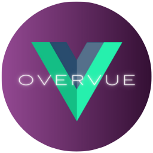
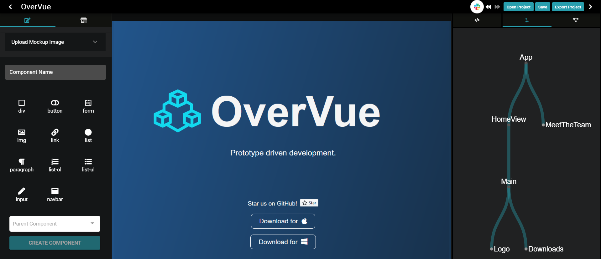
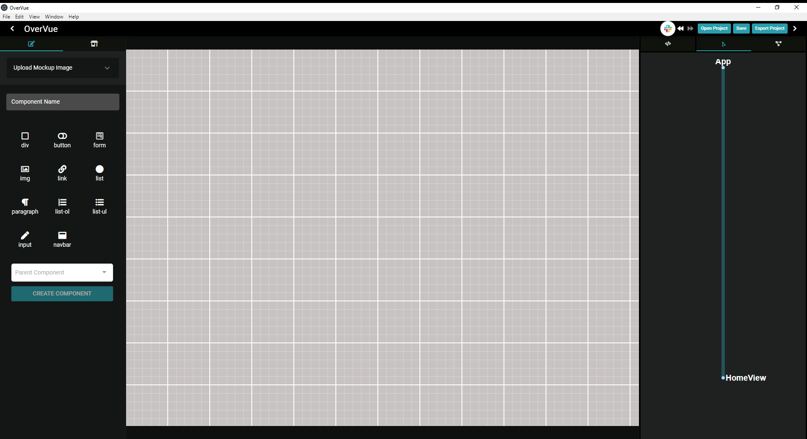
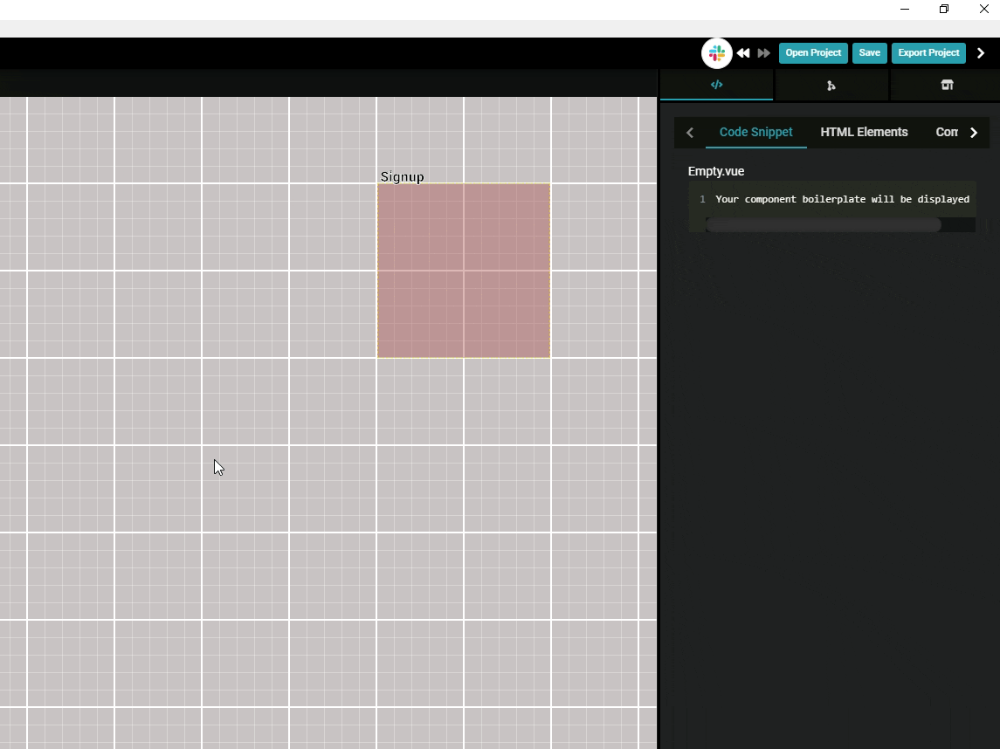
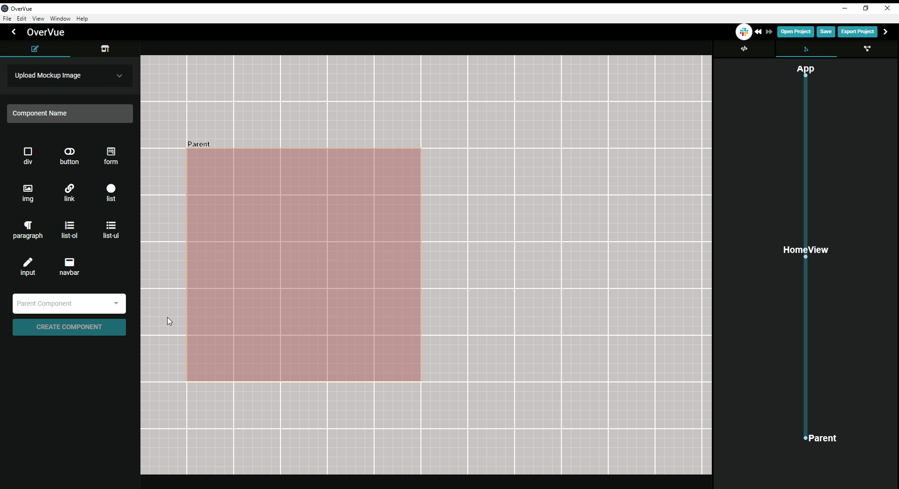

<h1 align="center">
  
</h1>

<p align="center"><b>Prototyping Development Tool for Vue Developers</b></p>

<p>OverVue is a prototyping tool that allows developers to dynamically create and visualize a Vue application, implementing a real-time intuitive tree display of component hierarchy and a live-generated code preview. The easy-to-use GUI allows you to add HTML attributes and CSS properties to help the developer envision their next project. The resulting boilerplate code can be exported as a template for further development in your IDE of choice.</p>

<p>这个程序能帮你生成Vue 组件, 设置 routes , 也可以帮你显像Component Parent-Child组件树。你只要做一些小配置然后可以下载code boilerplate. 这样你就可以很方便简洁地生成Vue前台APP了！</p>



## Table of Contents

- [Table of Contents](#table-of-contents)
- [Installation](#installation)
  - [WSL Installation](#wsl-installation)
  - [Running the Docker Image](#running-the-docker-image)
- [How to use](#how-to-use)
- [BETA](#beta)
  - [Slack OAuth](#slack-oauth)
- [Changelog](#changelog)
- [Contributing](#contributing)
- [Authors](#authors)

## Installation

To download the production version for windows or mac, please visit https://www.overvue.org

Install dependencies

```
npm i
```

To run electron app in dev mode (note: Vue Devtools will launch automatically)

```
npm run dev
```

To build a new .zip / .deb

```
npm run build
```

### WSL Installation

**The ability to load the application and/or devtools requires a tool/application to run a linux display as WSL does not have any display drivers since it is based off of just a CLI.
I recommend X410 (https://x410.dev/), althought it does cost \$15, for ease of use. There are free options such as VcXsrv(https://sourceforge.net/projects/vcxsrv/) that you can get, but requires more set up.**

If you choose to use VcXsrv, you will need to select a couple options:

<ul>
<li>Launch XLaunch</li>
<li>Select multiple windows and display number=0.</li>
<li>Select no client.</li>
<li>Select Clipboard, Primary Selection, Native opengl, and disable access control.</li>
<li>If Windows firewall pops up - select Public for this server to work.</li>
</ul>

If you choose to use x410, you will need to set the environment DISPLAY variable on each console:

So, to open either the Vue devtools or OverVue in dev mode, first start your X Server then enter into the terminal:
For WSL 1 :

```
export DISPLAY=:0
```

For WSL 2 :

```
export DISPLAY=$(awk '/nameserver / {print $2; exit}' /etc/resolv.conf 2>/dev/null):0
export LIBGL_ALWAYS_INDIRECT=1
```

Then run the following command to run both OverVue and Vue developer tools.

```
npm run dev
```

To launch the Vue devloper tool, use the following command.

```
./node_modules/.bin/vue-devtools
```

Then to start only OverVue in developer mode, open a new terminal instance and set the DISPLAY value again (re-enter above command for DISPLAY):

```
quasar dev -m electron
```

**NOTE**:


There might be an npm install error despite all instructions. Try the following command below:</li>

```
sudo apt install libgconf-2-4 libatk1.0-0 libatk-bridge2.0-0 libgdk-pixbuf2.0-0 libgtk-3-0 libgbm-dev libnss3-dev libxss-dev
```

## Running the Docker Image

To run the built version, pull down the docker image from [Docker repo]

In your terminal, run:

```
docker run -v /tmp/.X11-unix:/tmp/.X11-unix -e DISPLAY=$DISPLAY -v`pwd`/src:/app/src --rm -it overvue
```

### Running the dev environment on Docker as a Mac User

To run OverVue through Docker on a Mac, you'll need to install XQuartz:

```
brew install --cask xquartz
```

<strong>Important:</strong> RESTART your computer.

Update your PATH variable to /opt/x11/bin to your .zshrc. For example:

```
export PATH=/opt/X11/bin:$PATH
```

Set up XQuartz:

<ul>
<li>Launch XQuartz</li>
<li>Under the XQuartz menu, select Preferences.</li>
<li>Go to the security tab and ensure "Allow connections from network clients" is checked.</li>
<li>Restart XQuartz</li>
</ul>

Run the following command in your terminal (replacing localhostname with your local host name)

```
xhost +localhostname
```

If you don't know your local host name, run the following command to find it:

```
echo $(hostname)
```

Build the image using Dockerfile-Mac:

```
docker build -t overvue -f Dockerfile-Mac .
```

Run the image using the following command

```
docker run -it --env="DISPLAY=$(ifconfig en0 | grep inet | awk '$1=="inet" {print$2}'):0" --security-opt seccomp=./chrome.json overvue
```

Run in dev mode using:

```
npm run dev
```

For more information about running Electron through Docker on a Mac, check out these posts:

<li><a href="https://jaked.org/blog/2021-02-18-How-to-run-Electron-on-Linux-on-Docker-on-Mac">How to run Electron on Linux on Docker on Mac</a></li>
<li><a href="https://gist.github.com/paul-krohn/e45f96181b1cf5e536325d1bdee6c949">Workaround for sockets on Docker on macOS</a></li>
<li><a href="https://blog.jessfraz.com/post/how-to-use-new-docker-seccomp-profiles/">How to use new Docker seccomp profiles</a></li>
<br/>

### Running the dev environment on Docker as a WSL user

Build the image using Dockerfile-WSL:

```
docker build -t overvue -f Dockerfile-WSL .
```

To run

```
docker run -v /tmp/.X11-unix:/tmp/.X11-unix -e DISPLAY=$DISPLAY -v`pwd`/src:/app/src --rm -it overvue bash
```

Run in dev mode using:

```
npm run dev
```

[↥ Back to top](#table-of-contents)
<br/>

## How to use

- OverVue will assign a default root App component and a default route called "HomeView"

- To add a new component, type its name in the component name box and select any HTML elements that should be rendered by that component.
- HTML elements can also be added after creation by selecting the component in the display, then selecting HTML elements.
- You may nest HTML elements by dragging and dropping elements in the list tree view in either the right sidebar or the component modal (which can be opened by double clicking on a component node in the tree)

- Select a parent component for the new component if needed.
- After creating the component, you can drag the component node to reassign its parent and change the tree structure. For advanced styling options, double click on the desired HTML element to modify. Here, you may add attributes such as class, ID, and v-model.
  

- The right-side, Component Details > Code Preview Tab displays live code preview for the selected component.
  

- You can view, add, and delete new routes and associated components in the right-side, Routes Tab.
  

- State and actions can be created, edited, and assigned to components.
  

- When finished creating, view your code preview under the code preview tab and you can export to a file location of your choice. Below is the exported file structure:

```
public/
  index.html
src/
  assets/
  components/
    UserCreatedComponent1.vue
    UserCreatedComponent2.vue
    ...
  router/
    index.js
  views/
    HomeView.vue
    UserCreatedRouteComponent1.vue
    UserCreatedRouteComponent2.vue
    ...
  App.vue
  main.js
babel.config.js
package.json
```

- To get a better look at the features and how to use OverVue, take a look at the in-app tutorial!

<br/>

[↥ Back to top](#table-of-contents)

### Changelog

### Changelog 2.0

<details><summary>OverVue 2.0</summary>
  <ul>
  <li>Improved hierarchy tree rendering</li>
  <li>Improved Route addition and deletion</li>
  <li>Able to search for components by name</li>
  <li>Improved UI to be more informative</li>
  <li>UI is more reactive, code snippets update dynamically </li>
  <li>Component children menu is consistent with children list at time of creation</li>
  <li>Children components can no longer choose any of their ancestors to be their children.</li>
  <li>Can now use Quasar build -m electron to make windows .exe </li>
  <li>Exporting projects now exports the mockup files as well into the assets folder</li>
  <li>Saving projects now saves the mockup image url</li>
  <li>Extensive bug fixing for Vue component and HTML element deletion behavior, exporting and saving.</li>
  </ul>
</details>

### Changelog 3.0

<details><summary>OverVue 3.0</summary>
  <ul>
  <li>Implemented full component edit functionality</li>
  <li>Improved sidebar user interface to consolidate edit functionality</li>
  <li>UI is more reactive, improved dashboard's ability to update dynamically </li>
  <li>Added ability to incorporate Vuex in application</li>
  <li>Updated component details section to better display all aspects of a component</li>
  <li>Added action, state, and props section to component details dashboard</li>
  <li>New Vuex store dashboard section</li>
  <li>More robust code snippets with Vuex props, state, and actions included</li>
  <li>Bug fixes for parent/child issues</li>
  <li>Improved Documentation for easier onboarding of new contributors</li>
  </ul>
</details>

### Changelog 4.0

<details><summary>OverVue 4.0</summary>
  <ul>
    <li>Integrated Slack through a Slack Login button to link user's slack channel to their OverVue instance</li>
    <li>After logging in with Slack, user's have the ability to send a message to their selected Slack channel after saving</li>
    <li>Implemented the ability to delete State and Actions from the store</li>
    <li>Added the feature to quickly copy/paste Components through hotkeys</li>
    <li>Reworked the interface to give users a more intuitive experience</li>
    <ul>
      <li>Moved bottom dashboard to the right</li>
      <li>Features on the left are geared toward creation/editing components</li>
      <li>Features on the right are geared toward viewing overall hierarchy of App Prototype</li>
      <li>Component Editor menu now switches between create/edit mode depending on if a Component is selected</li>
      <li>Vuex Store and Actions now moved to left menu with ability to view/create/delete state and actions</li>
    </ul>
    <li>Implemented Vue Devtools for development ease</li>
    <li>Sped up component tree rendering speed for quicker, smoother viewing</li>
    <br>
    <h4><strong>Bug Fixes</strong></h4>
    <li>Fixed html buttons not properly rendering for selected component</li>
    <li>Fixed code snippet not properly rendering for selected component</li>
    <li>Fixed JSON parser typeerror with component html lists</li>
    <li>Fixed component tree view rendering instability with right sidebar</li>
    <li>Fixed children and parent relationship mutations causing type related side effects</li>
    <li>Fixed issue where state/actions deleted in store aren't reflected across components</li>
    <li>Fixed issue with undo feature that would delete inputed text one character at a time</li>
  </ul>
</details>

### Changelog 5.0

<details><summary>OverVue 5.0</summary>
  <ul>
    <li>Upgraded source code to Vue 3</li>
    <li>Upgraded major dependencies to newest versions</li>
    <ul>
      <li>Upgraded from Vuex 3 to Vuex 4</li>
      <li>Upgraded from Electron 5 to 16</li>
      <li>Upgraded from Quasar 1 to 2</li>
    </ul>
    <li>Rewrote exports in Vue 3</li>
    <li>Reconfigured Vue Devtools to launch and connect upon running quasar in dev mode</li>
    <li>Note that due to breaking changes when upgrading to Vue 3, vued3tree had to be replaced with vue3-tree.Due to this, a bulleted list currently renders instead of a tree.  This is intended to be a short-term change, with the old package being utilized again once it is compatible.</li>
  </ul>
</details>

### Changelog 6.0

<details><summary>OverVue 6.0</summary>
  <ul>
    <li>Toggle to TypeScript mode to generate code snippets and export your project or individual components in TypeScript</li>
    <li>An interactive and real-time tree display of your component hierarchy allows you to easily visualize parent-child component relationships and the Vue Router structure</li>
    <li>Enhance your workflow by adding notes to your components. When you export your project or components into your favorite IDE, notes will be converted into comments within your Vue files.</li>
    <li>Now with a “Get Started” tutorial, a visual queue of your HTML elements, and an overall simplified UI, OveVue is as intuitive as ever. </li>
    <li>OverVue is now containerized with Docker to bring developers the same experience, regardless of your operating system.</li>
    <br>
    <h4><strong>Bug Fixes</strong></h4>
    <li>Fixed drawer disappearing when the window size is smaller</li>
    <li>Fixed inability to delete parent/child relationship</li>
    <li>Fixed the inability to add multiple children to parent except when making a new component</li>
    <li>Fixed CodeSnippet does not scroll when it overflows the container</li>
    <li>Fixed clicking canvas does not fully deactivate active component</li>
    <li>Fixed Error handling for 'pasting' component when no component is copied</li>
    <li>Fixed dancing components</li>
    <li>Fixed project tree visulization</li>
  </ul>
</details>

### Changelog 7.0

<details><summary>OverVue 7.0</summary>
<ul>
<li>Color customizability of components </li>
<li>Code snippet reflects CSS styling of components </li>
<li>Added more semantic HTML tags</li>
<li>Options to add class, ID, and v-model attributes</li>
<li>Added drag and drop feature when adding/altering HTML tags</li>
<li>Ability to add child components to the code snippet of parent components </li>
<li>Added scoped style tags - On class creation will create styling entry with positioning of component/html element</li>
<li>Consolidated state/actions/props into one tab</li>
<li>UI overhaul</li>
<br>
<h4><strong>Bug Fixes</strong></h4>
<li>Fixed undo and redo capabilities </li>
<li>Fixed badge number not rendering for nested HTML tags</li>
</ul>
</details>

### Changelog 8.0

<details><summary>OverVue 8.0</summary>
<ul>
<li>Added component snap to grid functionality with additional grid density drop down menu feature</li>
<li>Code snippet reflects CSS grid area styling of components </li>
<li>Ability to import components from Element Plus library</li>
<li>Exported project template code now more accurately reflects component placement in app</li>
<li>Improved canvas drag and deselect</li>
<li>Improved WSL developer installation instructions</li>
<li>Added TypeScipt to application</li>
<li>Implemented component search bar feature</li>
<li>Ability to add Google and Github OAuth to exported project</li>
<li>Added unit testing and component testing boilerplate to exported project</li>
<li>UI overhaul</li>
<br>
<h4><strong>Bug Fixes</strong></h4>
<li>Fixed routing components in project exports </li>
<li>Fixed component hierarchy in project exports </li>
<li>Fixed import statements of route child components</li>
<li>Fixed edge case HTML element bugs in project exports </li>
<li>Fixed in app component movement bugs which caused position to not update correctly </li>
<li>Fixed drag and drop HTML element on click bug</li>
<li>Eliminated code redundancy by implementing mixins</li>
</ul>
</details>

### Changelog 9.0

<details><summary>OverVue 9.0</summary>
<ul>
<li>Converted codebase (40+ components) from Options API to Composition API</li>
<li>Migrated store from Vuex to Pinia</li>
<li>Migrated codebase to TypeScript</li>
<li>Implemented testing of Pinia store</li>
<li>Updated Electron builder dependency</li>
<li>UI overhaul</li>
<br>
<h4><strong>Bug Fixes</strong></h4>
<li>Fixed nesting HTML elements functionality</li>
<li>Fixed adding innerText functionality</li>
<li>Fixed formatting of exported code</li>
<li>Fixed parent child component relationship in code snippet and on export</li>
<li>Fixed typing and initial values of store to match actions usage</li>
<li>Eliminated code redundancy by implementing Composition API and Pinia</li>
</ul>
</details>
<br/>

### Changelog 10.0

<details><summary>OverVue 10.0</summary>
<ul>
<li>Overhauled main view to be an interactive and intuitive tree view</li>
<li>Updated HTML Elements list to have nested elements</li>
<li>Created a focused component modal</li>
<li>Integrated a11y-friendly Vuetensils component library</li>
<li>Added unit testing for main tree view feature</li>
<li>Refactored codebase, removing unneeded comments, unused files, console logs</li>
<li>Cleaned UI of side bars</li>
<li>Added previous main grid view to toggle (in top right settings)</li>
<br>
<h4><strong>Bug Fixes</strong></h4>
<li>Fixed HTML elements not live rendering</li>
<li>Fixed delete HTML element functionality being inconsistent</li>
<li>Fixed Code Preview having unexpected code (i.e. v-model=undefined)</li>
<li>Fixed various bugs related to empty HTML lists or routes with no children</li>
<li>Fixed import statements and nesting in Code Preview and exported code</li>
<li>Fixed entire testing suite</li>
</ul>
</details>
<br/>

[↥Back to top](#table-of-contents)

## Contributing

We'd love for you to test out the application and submit any issues you encounter. Also feel free to fork to your own repo and submit PRs.
Here are some features we're thinking about adding:

- Ability to choose options or composition API for code preview and exported code
- Ability to choose Vuex or Pinia for code preview and exported code
- Ability to add two-way binding to input elements
- Expand testing suite and add more dynamic tests
- Reincorporate Slack OAuth
- Add styling and script tags to Vuetensils boilerplate

Smaller changes that can be worked on:

- Removing ghost image when dragging HTML elements
- Highlight active HTML element when selected/updating
- Remove duplicate imports and account for nested components in Vuetensils import statement

<br/>

[↥Back to top](#table-of-contents)

## Authors

```
Contributors:
Joseph Eisele @jeisele2
Dean Chung @deanfchung
Dean Ohashi @dnohashi
Drew Nguyen @drewngyen
Alexander Havas @LOLDragoon
Keriann Lin @keliphan
Allison Pratt @allisons11
Joju Olaode @JojuOlaode
Sean Grace @ziggrace
Nicholas Schillaci @schillaci767
Terry Tilley @codeByCandlelight
Faraz Moallemi @farazmoallemi
Alex Lu @aleckslu
Jeffrey Sul @jeffreysul
Kenny Lee @kennyea
Ryan Bender @rdbender
Sonny Nguyen @sn163
Gabriela Kokhabi @gkokhabi
Ross Lamerson @lamerson28
Shanon Lee @shanonlee541
Zoew McGrath @Z-McGrath
Aram Paparian @apaparian
Bryan Bart @MrBeeAreWhy
Julia Bakerink @jbbake
Kerolos Nesem @Kerolos-Nesem
Megan Nadkarni @megatera
Johnny Chan @jchan444
Jace Crowe @JaceCrowe
Keyla Koizumi Nishimura @keylakoizumin
Katherine Kim @katherinek123
Chris Wong @Koregano73
Honghao(Michael) Sun @sunhonghaoparis
Alex Law @alexlaw528
Emma Genesen @EGenesen
Jigar Patel @jigarxp
Linden Young @lindenyoung
Chris Davis @chdavis0917
Ji Kim @dwejikim
Janica Abagat @janicaa1
Jaime de Venecia @jdvplus
Trisha Duong @trishanduong
David Lee @GomDave
```

Inspired by [PreVue](https://github.com/open-source-labs/PreVue)

<br/>

[↥Back to top](#table-of-contents)
